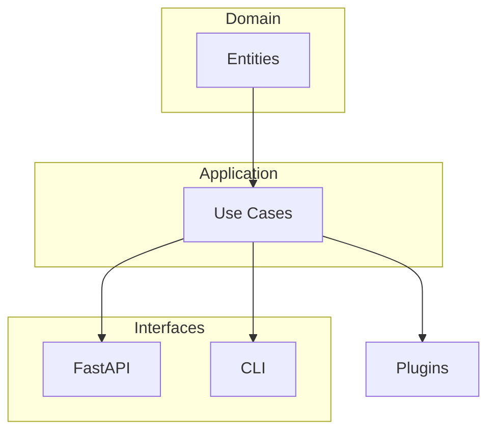

#  cognitive-core-engine

> Базовий рушій для когнітивних сервісів із API, CLI та підтримкою плагінів.

[](https://github.com/neuron7x/cognitive-core-engine/actions/workflows/ci.yml)
[](https://github.com/neuron7x/cognitive-core-engine/actions/workflows/codeql.yml)
[](https://www.python.org/)
[](LICENSE)


## Зміст
- [Огляд](#огляд)
- [Особливості](#особливості)
- [Встановлення](#встановлення)
- [Швидкий старт](#швидкий-старт)
- [API](#api)
- [CLI](#cli)
- [Тестування](#тестування)
- [Архітектура](#архітектура)
- [Дорожня карта](#дорожня-карта)
- [Документація](#документація)
- [Спільнота](#спільнота)
- [Ліцензія](#ліцензія)

## Огляд
`cognitive-core-engine` забезпечує базові компоненти для побудови та виконання когнітивних сервісів.  
Проєкт включає API, CLI та інструменти для розробки.

## Особливості
- Відкритий HTTP API на FastAPI  
- CLI `cogctl`  
- Плагінна система  
- Тести та CI  

## Встановлення
```bash
pip install -e '.[api,test,dev]'
```

## Швидкий старт

```bash
cogctl --help
```

### Генерація ресурсів

```bash
python tools/gen_assets.py
```

Скрипт `tools/gen_assets.py` створює допоміжні графічні файли у каталогах:

* `assets/logo.svg`
* `assets/og-banner.png`
* `media/api-demo.gif`
* `media/cli-demo.gif`

> Примітка: запуск скрипта є **ідемпотентним** — повторні запуски перегенерують артефакти без помилок.

### Тестування

```bash
# Повний прогін
pytest -q

# Лише тести генерації ресурсів
pytest tests/tools/test_gen_assets.py -q
```

Якщо ви запускаєте тести в CI, переконайтеся, що робочий каталог має права на запис у `assets/` та `media/`.

## API
Демо-GIF можна згенерувати через `tools/gen_assets.py`.
Докладніше див. [docs/api.md](docs/api.md).

```bash
# Перевірка стану сервісу
curl http://localhost:8000/api/health

# Обчислення скалярного добутку
curl -X POST http://localhost:8000/api/dot \
  -H "Content-Type: application/json" \
  -d '{"a": [1, 2, 3], "b": [4, 5, 6]}'
```

## CLI
Демо-GIF для CLI також генерується скриптом.
Ознайомтеся з [docs/operations.md](docs/operations.md) для деталей.

```bash
# Скалярний добуток векторами
cogctl dotv 1,2,3 4,5,6

# Розв'язання системи 2x2
cogctl solve2x2 1 2 3 4 5 6
```

## Архітектура



## Дорожня карта

* [ ] Опублікувати першу версію на PyPI
* [ ] Розширити каталог плагінів
* [ ] Додати приклади використання

## Документація

- [API](docs/api.md)
- [Архітектура](docs/architecture.md)
- [Операції](docs/operations.md)
- [Швидкий старт](docs/quickstart.md)
- [Метрики](docs/metrics.md)
- [ISR](docs/isr.md)
- [Гварди](docs/guards.md)

## Спільнота

* [Посібник для контриб'юторів](CONTRIBUTING.md)
* [Кодекс поведінки](CODE_OF_CONDUCT.md)
* [Політика безпеки](SECURITY.md)

## Ліцензія

Цей проєкт розповсюджується за ліцензією [MIT](LICENSE).

