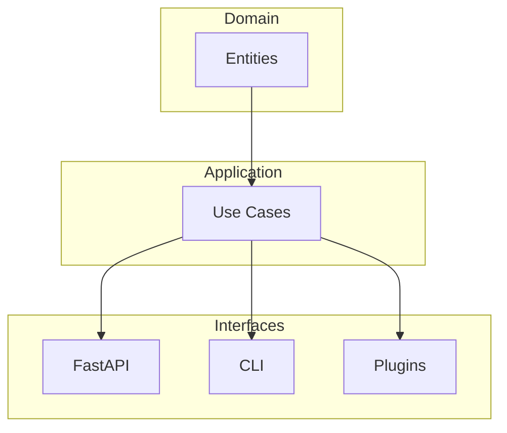

# Architecture

The engine follows the principles of Clean Architecture, separating domain logic from framework-specific concerns.



## Layers
- **domain**: entities and invariants
- **app**: use cases and services (pure logic)
- **api**: FastAPI routers (health, math, sse)
- **plugins**: registry and examples
- **tests**: unit and end-to-end

## Setup
1. Install dependencies:
   ```bash
   make setup
   ```
2. Run the API server:
   ```bash
   make api
   ```
