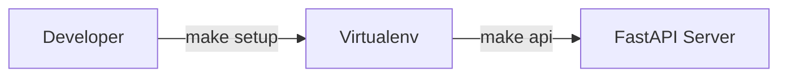
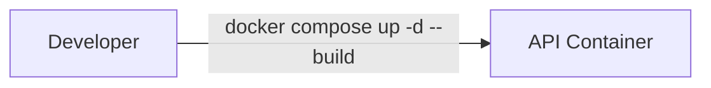

# Operations

## Local

Steps:
1. Install dependencies and start the API:
   ```bash
   make setup
   make api
   ```
2. Open the docs at [http://localhost:8000/docs](http://localhost:8000/docs).

## Docker

Steps:
1. Build and run services:
   ```bash
   docker compose up -d --build
   ```
2. Follow logs:
   ```bash
   docker compose logs -f api
   ```
