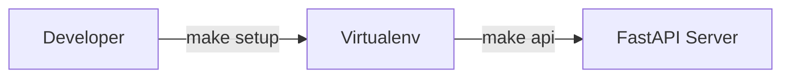
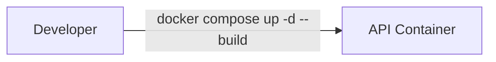
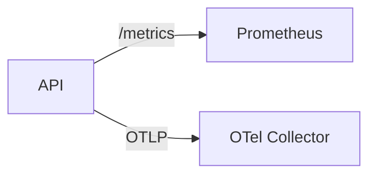

# Operations

## Local

Steps:
1. Install dependencies and start the API:
   ```bash
   make setup
   make api
   ```
2. Open the docs at [http://localhost:8000/docs](http://localhost:8000/docs).

## Docker

Steps:
1. Build and run services:
   ```bash
   docker compose up -d --build
   ```
2. Follow logs:
   ```bash
   docker compose logs -f api
   ```

> **Note:** The Docker image runs as the unprivileged `appuser` account. If you override the compose configuration to mount a local path into `/app`, ensure the mounted directory grants read (and write, if needed) access to UID 1000 inside the container. For example, adjust permissions on the host before starting services:
> ```bash
> sudo chown -R 1000:1000 /path/to/project
> ```
> Alternatively, use group-based permissions so that the directory is accessible without changing ownership.

## Observability

Steps:
1. Start the API; metrics are exposed at `http://localhost:8000/metrics`.
2. Run Prometheus to scrape the metrics:
   ```bash
   docker run -p 9090:9090 prom/prometheus
   ```
3. Configure an OpenTelemetry collector (or Jaeger) and set `OTEL_EXPORTER_OTLP_ENDPOINT` to forward traces.

Structured JSON logs are emitted to STDOUT by default. Correlated fields include:

- `request_id`, `http_method`, `http_route`, `http_status`
- `trace_id`/`span_id` when OpenTelemetry tracing is active
- `duration_ms`, `client_ip`, and user-provided `extra` fields

Tune verbosity through the `COG_LOG_LEVEL` environment variable. Use `DEBUG` when
diagnosing incidents and revert to `INFO` in steady state to limit noise.

## Deployment (Розгортання)

1. **Підготуйте артефакти.** Зберіть Docker-образ та прогоніть авто-тести:
   ```bash
   docker build -t registry.example.com/cognitive-core:$(git rev-parse --short HEAD) .
   pytest
   ```
2. **Оновіть конфігурацію середовища.** Переконайтеся, що в секретах
   налаштовано `COG_API_KEY`, мережеві обмеження (`COG_ALLOWED_ORIGINS`),
   журнальний рівень (`COG_LOG_LEVEL`) та параметри рейт-лімітера.
3. **Застосуйте міграції бази (за потреби).**
   ```bash
   cogctl migrate up
   ```
4. **Розгорніть сервіс.** Використовуйте улюблену оркестрацію (Docker Compose,
   Kubernetes, Nomad). Для Kubernetes додавайте readiness/liveness-проби, які
   опитують `/api/health/ready` та `/api/health/live`.
5. **Перевірте розгортання.**
   ```bash
   curl -H "X-API-Key: $COG_API_KEY" https://service.example.com/api/health
   ```
6. **Під'єднайте спостереження.** Додайте job у Prometheus для `/metrics` і
   скеруйте OpenTelemetry експортер на колектор.

## Updating (Оновлення)

1. Перегляньте [CHANGELOG](../CHANGELOG.md) на предмет несумісних змін.
2. Увімкніть розширене логування (`COG_LOG_LEVEL=DEBUG`) лише на одному інстансі
   для моніторингу під час оновлення.
3. Запустіть оновлені образи по одному (rolling update / blue-green). Переконайтеся,
   що новий інстанс пройшов health-checkи, перш ніж виводити попередній.
4. Після оновлення перевірте:
   - `/metrics` — чи збираються нові метрики
   - OpenTelemetry трейс у трейсінг-системі
   - Відсутність помилок у структурованих логах
5. Поверніть `COG_LOG_LEVEL` до робочого значення.

## Incident Response / Аварійні процедури

1. **Виявлення.** Слідкуйте за алертами Prometheus (latency, кількість 5xx) та
   за лімітом токенів LLM.
2. **Діагностика.** Використовуйте структуровані логи, відфільтрувавши їх за
   `request_id` або `trace_id`. При потребі увімкніть `DEBUG` тільки на проблемному
   вузлі.
3. **Мітігація.**
   - Перезапустіть API контейнер або зробіть `kubectl rollout restart` для
     швидкого відновлення.
   - Якщо зовнішній сервіс (БД, Redis) недоступний — переведіть трафік на
     резервний екземпляр.
4. **Відкат.** Зафіксуйте версію, яка працювала стабільно, і виконайте деплой
   попереднього образу.
5. **Постмортем.** Збережіть вибірку логів і трейси за період інциденту та
   задокументуйте у внутрішньому звіті.
