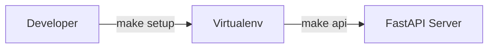
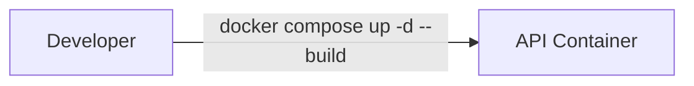
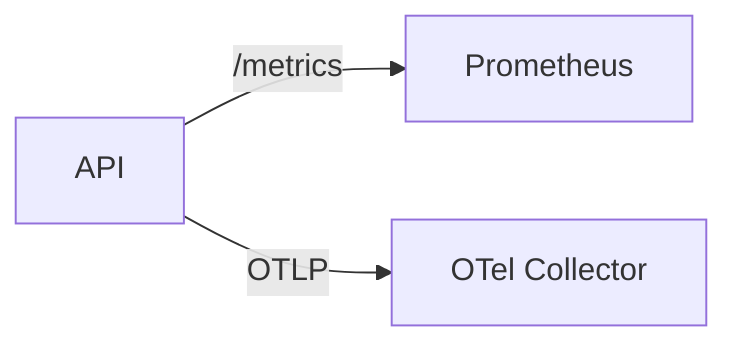

# Operations

## Local

Steps:
1. Install dependencies and start the API:
   ```bash
   make setup
   make api
   ```
2. Open the docs at [http://localhost:8000/docs](http://localhost:8000/docs).

## Docker

Steps:
1. Build and run services:
   ```bash
   docker compose up -d --build
   ```
2. Follow logs:
   ```bash
   docker compose logs -f api
   ```

> **Note:** The Docker image runs as the unprivileged `appuser` account. If you override the compose configuration to mount a local path into `/app`, ensure the mounted directory grants read (and write, if needed) access to UID 1000 inside the container. For example, adjust permissions on the host before starting services:
> ```bash
> sudo chown -R 1000:1000 /path/to/project
> ```
> Alternatively, use group-based permissions so that the directory is accessible without changing ownership.

## Observability

Steps:
1. Start the API; metrics are exposed at `http://localhost:8000/metrics`.
2. Run Prometheus to scrape the metrics:
   ```bash
   docker run -p 9090:9090 prom/prometheus
   ```
3. Configure an OpenTelemetry collector (or Jaeger) and set `OTEL_EXPORTER_OTLP_ENDPOINT` to forward traces.
