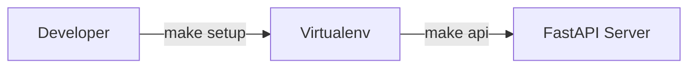
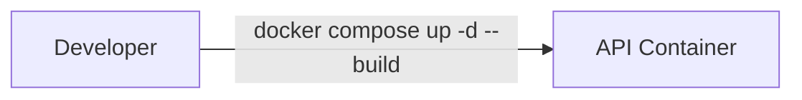
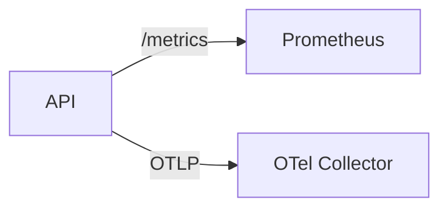

# Operations

## Local

Steps:
1. Install dependencies and start the API:
   ```bash
   make setup
   make api
   ```
2. Open the docs at [http://localhost:8000/docs](http://localhost:8000/docs).

## Docker

Steps:
1. Build and run services:
   ```bash
   docker compose up -d --build
   ```
2. Follow logs:
   ```bash
    docker compose logs -f api
  ```

> **Note:** The Docker image runs as the unprivileged `appuser` account (UID/GID 1000). During the build the Dockerfile aligns permissions for the project directories (including `/app/bin` and `/app/tools`) and marks helper scripts as executable for this user. If you override the compose configuration to mount a local path into `/app`, ensure the mounted directory grants read (and write, if needed) access to UID 1000 inside the container. For example, adjust permissions on the host before starting services:
> ```bash
> sudo chown -R 1000:1000 /path/to/project
> ```
> Alternatively, use group-based permissions so that the directory is accessible without changing ownership.

## Dependency management

Use [`pip-tools`](https://github.com/jazzband/pip-tools) to keep dependency pins and the lock file consistent with `requirements.txt`.

1. Edit `pyproject.toml` to add or upgrade dependencies (and `requirements.txt` if new extras are exposed). Prefer ranges with upper bounds so updates remain controlled.
2. Ensure you are in an environment with internet access and install the tooling (once per environment):
   ```bash
   python -m pip install --upgrade pip pip-tools
   ```
3. Recompile the lock file with hashes for everything listed in `requirements.txt`:
   ```bash
   pip-compile requirements.txt --generate-hashes --output-file requirements.lock
   ```
4. Review the diff, run the usual test suite (`pytest`) and commit `pyproject.toml`, `requirements.txt`, and `requirements.lock` together.

The CI workflow reruns the same `pip-compile` command and fails if the generated lock file does not match the committed version, so make sure to regenerate it before opening a pull request.

## Release workflow

Use the following checklist to publish a new version on PyPI:

1. **Update metadata.** Bump the version and classifiers in `pyproject.toml`, refresh the README snippets, and commit the changes.
2. **Build artifacts.** From a clean tree run:
   ```bash
   rm -rf dist/
   python -m build
   ```
3. **Validate metadata.** Ensure the generated archives pass the Twine check:
   ```bash
   python -m twine check dist/*
   ```
4. **Upload to PyPI.** Use an API token stored in `~/.pypirc` (or pass it via environment variables) and push the artifacts:
   ```bash
   python -m twine upload dist/*
   ```
   > Tip: export `TWINE_USERNAME=__token__` and `TWINE_PASSWORD=<pypi-token>` when running in CI.
5. **Tag the release.** Create a Git tag after a successful upload:
   ```bash
   git tag -a v$(python -c "import tomllib; print(tomllib.load(open('pyproject.toml','rb'))['project']['version'])") -m "Release"
   git push origin --tags
   ```
6. **Announce.** Update `README.md`, changelog entries, and notify the team.

## Observability

Steps:
1. Start the API; metrics are exposed at `http://localhost:8000/metrics`.
2. Run Prometheus to scrape the metrics:
   ```bash
   docker run -p 9090:9090 prom/prometheus
   ```
3. Configure an OpenTelemetry collector (or Jaeger) and set `OTEL_EXPORTER_OTLP_ENDPOINT` to forward traces.
